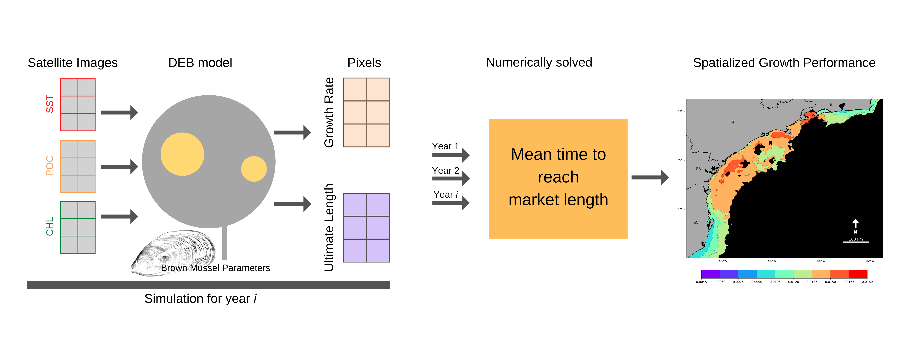

# Mussel culture assessment in the South of Brazil

Data and code used for the article ["Assessing bivalve growth using bio-energetic models"](https://authors.elsevier.com/a/1fkoN15DJ-5f1a). Mussel growth assessment throughout the brazilian Southeastern coast using the Dynamic Energy Budget theory. 

- Remote sensing data has the prefix **NC**, and processing code are within the NCtools.py file
- Parameter estimation for the brown mussel *Perna perna* is in the folder with the species name. Files are to be used in the [DEBtool](https://github.com/add-my-pet/DEBtool_M) program for Matlab. Resulting parameters are found in the **results_Perna_perna.mat** file. 
- Actual processing was done using the files with prefix **Run**, as well as the available IPython notebooks included in this repository. Mathematical description of the code is provided in the published manuscript.

Tan, T.Y., Miraldo, M.C., Fontes, R.F.C., Vannucchi, F.S., 2022. Assessing bivalve growth using bio-energetic models. Ecological Modelling 473, 110069. https://doi.org/10.1016/j.ecolmodel.2022.110069
